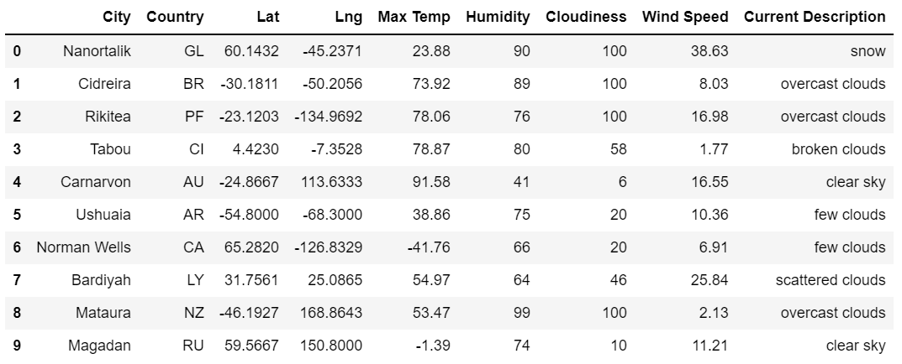
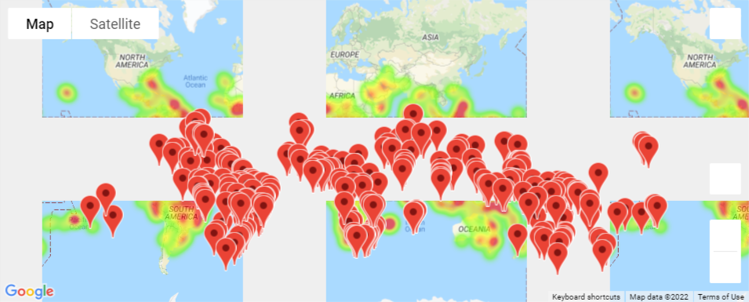
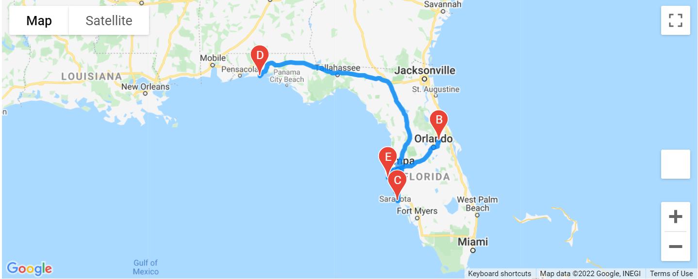
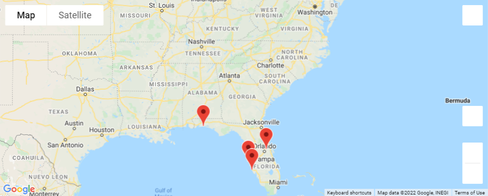

# World_Weather_Analysis

## Overview
- Use openweathermap and google map API to get the weather data for random created city list
- create search list for vacation for user entered temperature range
- create itenerary using google map api for city location entered

## Result
- Weather Database 
  

- Vacation Search
  

- Vacation_Itinerary

  

  
